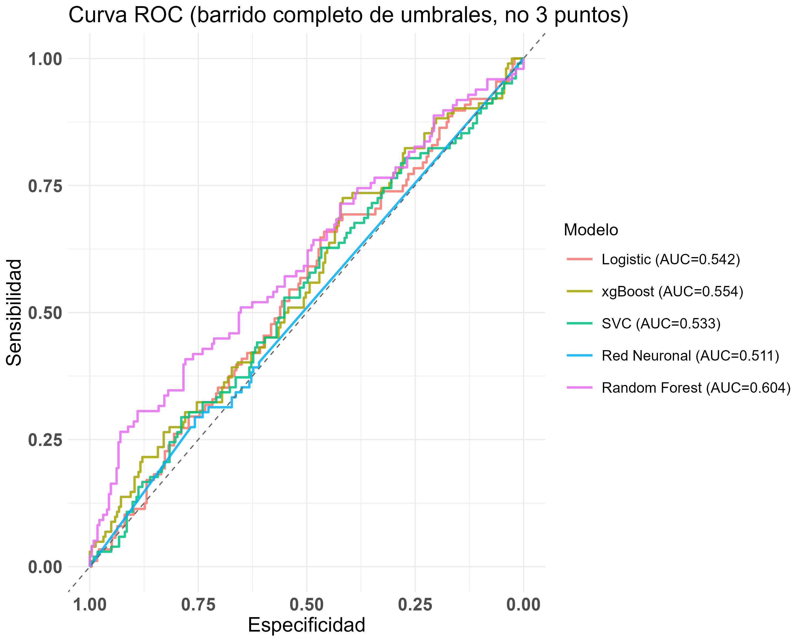
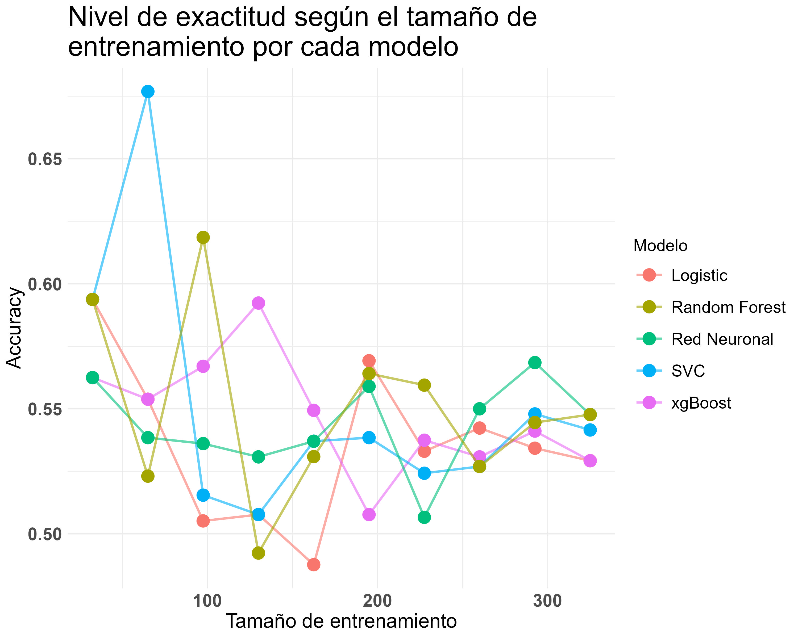

# Binary Classification in R

Freelance project applying and comparing multiple binary classification algorithms in R on a survey-style dataset, including EDA, model training, and full performance evaluation (ROC/AUC, learning curves).

## What it does

`Proyect2.r` runs the full pipeline standalone, end to end:

- **Setup & EDA**: auto-installs any missing required packages, loads the survey data from `GUIA-1.xlsx`, profiles it (structure, unique values per categorical column, missing values), recodes the target variable (`RESULTADO`) to 0/1, and produces pie charts, a pairs plot, and bar plots (`ggplot2`, `gridExtra`).
- **Preprocessing**: scales numeric features and reduces them with PCA (keeping the first 15 components) before modeling.
- **Modeling**: trains and compares several classifiers — **Logistic Regression, XGBoost, SVM, a neural network (nnet), and Random Forest (randomForestSRC)** — using `caret` for evaluation and `pROC` for ROC/AUC.
- **Evaluation artifacts**: exported plots for the ROC curve, learning rate/curve, pairs plot, bar plot, and class distribution pie chart.

## Tech stack

R — `tidyverse`, `caret`, `xgboost`, `e1071`, `nnet`, `randomForestSRC`, `pROC`, `ggplot2`, `gridExtra`, `openxlsx`.

## Results

| ROC curve (real threshold sweep) | Learning curve |
|---|---|
|  |  |

**Honest AUC ranking** (one representative run — see "the split isn't reproducible" below for why the exact numbers move between runs): Random Forest is the best of a weak field (AUC 0.60), xgBoost/SVC/Logistic Regression are barely above coin-flip (0.53–0.55), and the Neural Network is statistically indistinguishable from random (AUC 0.511). None of the variable sets available (nationality, gender, ethnicity, academic credentials, language count, etc.) separates `BUENO`/`MALO` well.

**The accuracy-vs-baseline finding that matters more than any single model's score:** the response variable is 70%/30% (`MALO`/`BUENO`), so a trivial "always predict `MALO`" rule already scores 70% accuracy. Every one of the 5 tuned classifiers here scores **below that baseline** (53%–62% depending on the run) — not because the models are broken, but because each one uses a deliberately low decision threshold (0.005–0.31, see below) that trades overall accuracy for better recall on the minority `BUENO` class. A high-AUC-but-low-accuracy result is not a contradiction once you see the threshold that produced it.

**Justifying the 5 different thresholds** — each was compared against its own ROC-derived optimum (Youden's J statistic), from the same run as the ROC plot above:

| Modelo | AUC | Umbral usado | Umbral óptimo (Youden) |
|---|---|---|---|
| Regresión Logística | 0.542 | 0.310 | 0.295 |
| xgBoost | 0.554 | 0.150 | 0.059 |
| SVC | 0.533 | 0.100 | 0.073 |
| Red Neuronal | 0.511 | 0.005 | 1.000 |
| Random Forest | 0.604 | 0.300 | 0.381 |

Logistic Regression and Random Forest's hand-picked thresholds land reasonably close to their statistical optimum; xgBoost and SVC's are noticeably higher than optimal (under-predicting the positive class relative to what their own ROC curve would recommend). The Neural Network's Youden-optimal threshold of 1.0 is itself diagnostic — it means the ROC curve is so close to the diagonal that no threshold meaningfully separates the classes, consistent with its AUC of 0.511. The original hand-tuned thresholds look like they were picked to get *some* recall on the minority class by trial and error, not derived from the ROC curve — reasonable as a quick heuristic, but not something to treat as calibrated.

**The split isn't reproducible for at least one model, and that's not fixed here:** `dividir_datos()` calls `sample()` without its own seed, and `modelPipeline()` calls it once per classifier — so the 5 classifiers in the table above aren't even evaluated on the *same* test set as each other. Across several runs while verifying this: Logistic Regression's AUC genuinely moved (0.49–0.61) run to run, while xgBoost/SVC/Red Neuronal/Random Forest landed on the exact same AUC every time. That's not a fixed split — it's each model's own `set.seed(15)` deterministically re-seeding the RNG before it returns, which happens to make every split *after* the first one reproducible as a side effect, while Logistic Regression (first in the pipeline) still inherits whatever random state the R session started with. With only ~325 test rows, one misclassified row moves accuracy by ~0.3 points regardless, so treat any single run's numbers (including the table above) as illustrative of the pattern (weak AUC, sub-baseline accuracy) rather than an exact, fully reproducible benchmark.

## Project structure

```
codigos/Proyect2.r          # Full pipeline: setup, EDA, PCA, modeling, evaluation
datos/bases/GUIA-1.xlsx     # Source survey dataset
datos/resultados/           # rocCurve, learningRate, pairsPlot, barpPlot, pieChart, tabla_umbrales.csv
```

## How to run

Open `codigos/Proyect2.r` in RStudio (or run with `Rscript`) — it's self-contained and reads/writes relative to its own folder (`../datos/bases/`, `../datos/resultados/`). It calls a `verificar_paquetes()` helper at the top that automatically installs any of the required packages that aren't already present, so a fresh R environment is enough to get started. Update the `setwd('PATH')` call at the top of the script to point at `codigos/` before running.

## Notes from a live run

R *is* available after all (just not on `PATH` — found at `C:\Program Files\R\R-4.4.3\bin\Rscript.exe`), so this was actually executed end-to-end, not just statically reviewed.

- Fixed: `setwd()` at the top was hardcoded to an absolute path on the original author's machine — changed to a placeholder (`setwd('PATH')`) so it's obvious this needs to be set per-environment. `GUIA-1.xlsx` is already read via a relative path.
- Fixed: `verificar_paquetes()` never set a CRAN mirror, so on a machine missing any of the 10 required packages, `install.packages()` failed outright with "trying to use CRAN without setting a mirror" instead of installing it — added `options(repos = ...)` before the check runs.
- Fixed: the pairs plot used `pairs(...)` followed by `dev.copy(png, ...)`, which copies whatever is on the *currently active* graphics device — there isn't one in non-interactive `Rscript` execution (as opposed to RStudio), so the exported jpg was blank. Opening the `png()` device explicitly before plotting is what actually works headless.
- Fixed: the pairs plot excluded columns by numeric position (`select(df, c(-1, -3, -10, ...))`), which is both fragile and unreadable (axis labels were the raw dotted-and-truncated Excel column names). It now plots `varNumericas_toScale` — already exactly the complement of the categorical-columns list used elsewhere in the script — with real labels, colored by outcome.
- Fixed: the "ROC curve" was computed from *already-thresholded* 0/1 predictions (`roc(etiquetas, predicciones)`), which can only ever produce 2-3 points, not a curve. Each model function now also returns its continuous raw score, so the ROC curve and AUC are computed from a real threshold sweep (see "Results" above).
- `modelPipeline()` takes `varNum`/`varCat` parameters but never actually uses them — it reads `varNumericas_scaled` and `varCategoricas` from the global environment instead. It still works because those globals exist by the time the function is called, but the parameters are dead code and the argument order at the call sites doesn't match what the parameter names imply. Left as-is (out of scope for this pass, and the README's numbered results above don't depend on it).
- The 5 different hand-picked thresholds (0.31, 0.15, 0.1, 0.005, 0.3) are now checked against each model's own ROC-derived optimum in "Results" above, instead of being left unexplained.
